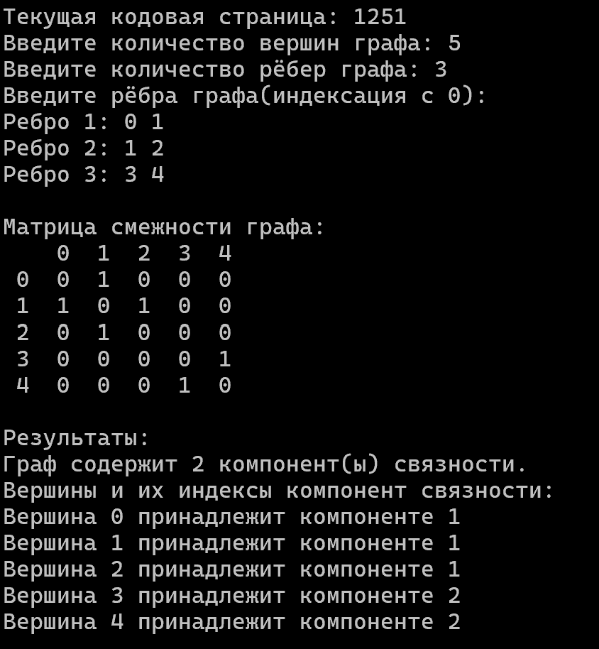

# Отчёт по расчётной работе по дисциплине ПиОИвИС


## Цель

Ознакомится с основнами теории графов, способами предсставления графов, базовыми алгоритмами для работы с разными видами графов.


## Задача

Составить матрицу смежности, определить компоненты цепей неориентированного графа.


## Вариант 2.17 (мс, нг)


## Ключевые понятия 

- Графовая структура (абсолютное понятие)  это такая одноуровневая реляционная структура, объекты которой могут играть роль либо вершины, либо связки;

  - Вершина (относительное понятие, ролевое отношение);

  -  Связка (относительное понятие, ролевое отношение).

- Графовая структура с ориентированными связками (абсолютное понятие)

  -Ориентированная связка (относительное понятие, ролевое отношение) – связка, которая задается ориентированным множеством.

-Графовая структура с неориентированными связками (абсолютное понятие)

   -Неориентированная связка (относительное понятие, ролевое отношение)– связка, которая задается неориентированным множеством.

-Гиперграф (абсолютное понятие) – это такая графовая структура, в которой связки могут связывать только вершины;

  -Гиперсвязка (относительное понятие, ролевое отношение);

   -Гипердуга (относительное понятие, ролевое отношение) – ориентированная гипер-связка;

    -Гиперребро (относительное понятие, ролевое отношение) – неориентированная гипер-связка.

-Псевдограф (абсолютное понятие) – это такой гиперграф, в котором все связки должны быть бинарными;

    -Бинарная связка (относительное понятие, ролевое отношение) – гиперсвязка арности 2;

    -Ребро (относительное понятие, ролевое отношение) – неориентированная гиперсвязка;

    -Дуга (относительное понятие, ролевое отношение) – ориентированная гиперсвязка;

    -Петля (относительное понятие, ролевое отношение) – бинарная связка, у которой первый и второй компоненты совпадают.

-Мультиграф (абсолютное понятие) – это такой псевдограф, в котором не может быть петель;

-Граф (абсолютное понятие) – это такой мультиграф, в котором не может быть кратных связок, т.е. связок у которых первый и второй компоненты совпадают;

-Неориентированный граф (абсолютное понятие) – это такой граф, в котором все связки являются ребрами;

-Ориентированный граф (абсолютное понятие) - это такой граф, в котором все связки являются дугами;

-Матрица смежности - матрица размера _nxn_, где _n_ - количетво вершин.


## Алгоритм решения
  1. **Ввод данных**

 1.1 Считываем количество вершин графа.

 1.2 Считываем количество рёбер графа.

 1.3 Считываем матрицу смежности, представляющую граф.

  2. **Определение компонент**

2.1 Нумеруем все вершины по порядку.

2.1 Выбираем первую вершину по порядку. 

2.2 Присваиваем всем вершинам, к которым мы можем прийти по ребрам от данной вершины номер компоненты.

2.3 Если остались вершины, которым не присвоена компонента, то:

2.4.1 Увиличиваем номер компоненты на 1.

2.4.2 Выбираем следующую по порядку вершину, которой не присвоен номер компоненты.

2.4.3 Возвращаемся к пункту 2.

  3. **Вывод результата**

3.1 Выводим все веришны по порядку с присвоенным им номером компоненты.

**Пример кода**
```c
#include <iostream>
#include <vector>
#include <iomanip> 

using namespace std;

// Поиск в глубину
void dfs(int node, int componentId, const vector<vector<int>>& adMatrix, vector<int>& component) {
    component[node] = componentId; 
    for (int neighbor = 0; neighbor < adMatrix.size(); neighbor++) {
        if (adMatrix[node][neighbor] == 1 && component[neighbor] == -1) {
            dfs(neighbor, componentId, adMatrix, component);
        }
    }
}

int main() {
    system("chcp 1251");
    // Ввод количества вершин и рёбер
    int n, m;
    cout << "Введите количество вершин графа: ";
    cin >> n;
    cout << "Введите количество рёбер графа: ";
    cin >> m;

    // Инициализация матрицы смежности
    vector<vector<int>> adMatrix(n, vector<int>(n, 0));

    // Ввод рёбер
    cout << "Введите рёбра графа(индексация с 0):" << endl;

    for (int i = 0; i < m; i++) {
        int u, v;
        cout << "Ребро " << i + 1 << ": ";
        cin >> u >> v;
        if (u < 0 || v < 0 || u >= n || v >= n) {
            cout << "Ошибка: вершины должны быть в диапазоне от 0 до " << n - 1 << endl;
            i--; 
            continue;
        }
        adMatrix[u][v] = 1;
        adMatrix[v][u] = 1; 
    }

    // Вывод матрицы смежности
    cout << endl << "Матрица смежности графа:" << endl;
    cout << "   "; 
    for (int i = 0; i < n; i++) {
        cout << setw(2) << i << " "; 
    }
    cout << endl;
    for (int i = 0; i < n; i++) {
        cout << setw(2) << i << " "; 
        for (int j = 0; j < n; j++) {
            cout << setw(2) << adMatrix[i][j] << " ";
        }
        cout << endl;
    }

    vector<int> component(n, -1); // Массив для хранения индексов компонент
    int componentId = 0;

    // Запуск DFS для нахождения всех компонент связности
    for (int i = 0; i < n; i++) {
        if (component[i] == -1) { 
            dfs(i, componentId, adMatrix, component);
            componentId++;
        }
    }

    // Вывод результата
    cout << endl << "Результаты:" << endl;
    cout << "Граф содержит " << componentId << " компонент(ы) связности." << endl;
    cout << "Вершины и их индексы компонент связности:" << endl;
    for (int i = 0; i < n; i++) {
        cout << "Вершина " << i << " принадлежит компоненте " << component[i] + 1 << endl;
    }

    return 0;
}
```

## Тестовый пример
### Матричный вид:


|0  |1  |0  |0  |0  |0  |
|1  |0  |0  |1  |0  |1  |
|0  |0  |0  |0  |1  |0  |
|0  |1  |0  |0  |0  |0  |
|0  |0  |1  |0  |0  |0  |
|0  |1  |0  |0  |0  |0  |





## Вывод
В результате выполнения данной работы были получены следующие пркатические навыки: изучены основы теории графов, изучены способы представления графов, изучены базовые алгоритмы для работы с графами.

